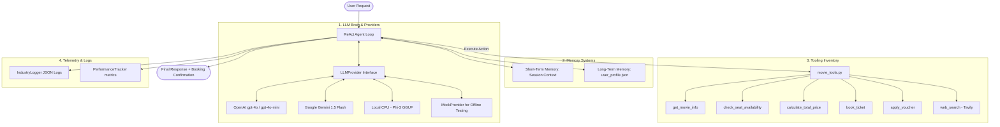

# 🎬 Lab 3: Production-Grade Movie Booking ReAct Agent with Memory

This repository implements a **Production-Grade Movie Booking Agent** using the **ReAct (Reasoning and Acting) framework** coupled with **Short-Term (Conversation History) and Long-Term (User Profile Persistence) Memory systems**. 

This system represents a significant shift from conversational LLMs (which fail to complete multi-step transactional logic) to agentic workflows that orchestrate external database state checks, complex pricing/discount math, and booking transactions.

---

## 🏗️ System Architecture

The architecture consists of four main pillars: **The LLM Brain**, **Memory Systems**, **Tooling Inventory**, and **Industry-Standard Telemetry**.



### 1. Memory Systems (`src/agent/memory.py`)
- **Short-Term Memory (Session Context)**: Temporarily keeps the dialogue logs of the current session.
- Long-Term Memory (User Profile)**: Persists user-specific traits to [memory/user_profile.json](./memory/user_profile.json). It tracks:
  - Preferred seat class (`VIP` vs `Standard`).
  - Favorite genres.
  - Active vouchers in wallet (e.g. `CGV30`, `STUDENT`).
  - Past booking history (updated automatically upon successful booking).

### 2. Tooling Inventory (`src/tools/movie_tools.py`)
A custom tool suite designed with strict parameters and JSON output:
- `get_movie_info`: Fetches genres, descriptions, and VIP/Standard prices for movies.
- `check_seat_availability`: Queries current layout. Standard seats are rows B and C; VIP seats are row A.
- `calculate_total_price`: Computes subtotals, concession combos, and voucher discounts.
- `book_ticket`: Allocates seat numbers, performs transactions, and writes the booking to database.
- `apply_voucher`: Verifies code percentage or fixed discount.
- `web_search`: Uses Tavily API to fetch live internet info, fallback to search mockup if offline.

---

## 🎯 Test Cases & Evaluation Suite (`run_eval.py`)

The evaluation script compares the **Baseline Chatbot** (which knows tool names but cannot invoke them) against the **ReAct Agent** (which operates in a Thought-Action-Observation loop).

### Test Scenarios
1. **Simple Query (Doctor Strange Showtimes)**: Checks search tool fallback for items missing from database.
2. **Showtimes & Price (Dune 2 VIP)**: Evaluates single-step database retrieval.
3. **Check Seats & Book (Batman)**: Requires checking available seats, calculating pricing for multiple tickets, and booking them.
4. **Memory & Loyalty Voucher (Dune 2)**: The agent must read long-term memory to extract the user's VIP seat preference, check A1, apply `CGV30` voucher from the user's wallet, calculate the discounted price, and perform the booking.

### Tracked Evaluation Metrics
- **Success Rate**: Did the agent correctly book/retrieve the requested items?
- **Response Latency (P50/P99)**: The duration of the entire execution.
- **Token Efficiency**: Compares Prompt vs Completion token counts.
- **Total Cost**: Computes approximate dollar usage based on API token rates.
- **Avg Steps**: Number of loops taken to resolve the query.

---

## 🚀 Getting Started

### 1. Setup Environment
Copy the environment template and configure your parameters:
```bash
cp .env.example .env
```
Open [.env](./.env) and set your key:
```env
OPENAI_API_KEY=sk-proj-yourActualKeyHere
DEFAULT_PROVIDER=openai
DEFAULT_MODEL=gpt-4o
```
> [!NOTE]
> **API Key Fallback**: If you run the evaluation suite without setting an API key, the script will notice and automatically launch in **`MockProvider`** mode. This simulates real OpenAI completions with pre-programmed behaviors so you can verify the loop logic locally without burning tokens.

### 2. Install Dependencies
```bash
pip install -r requirements.txt
```

### 3. Run the Evaluation Suite
To execute all test cases and compare Chatbot vs ReAct Agent performance:
```bash
python run_eval.py
```

### 4. Review Reports & Telemetry
- **Evaluation Summary**: Located at [logs/eval_summary.md](./logs/eval_summary.md) (with comparison tables).
- **Evaluation Logs**: Raw trace logs stored in [logs/eval_results.json](./logs/eval_results.json).
- **Group Report**: Finished lab report at [GROUP_REPORT_MOVIE_BOOKING.md](./report/group_report/GROUP_REPORT_MOVIE_BOOKING.md).
- **Individual Report**: Finished individual contribution report at [REPORT_MOVIE_AGENT.md](./report/individual_reports/REPORT_MOVIE_AGENT.md).
